# Android CI/CD Pipeline Documentation: Task Manager

This document provides complete instructions for configuring, managing, and maintaining the automated GitHub Actions CI/CD pipeline for **Task Manager** (`com.aryanmaheshwari.taskmanager`).

---

## 1. Overview & Pipeline Flow

When code is merged or pushed to the `main` branch (or triggered manually via `workflow_dispatch`):

```mermaid
flowchart LR
    A[Push / Dispatch to main] --> B[GitHub Actions Runner]
    B --> C[Setup JDK 17 & Gradle Cache]
    C --> D[Inject Gemini API Key & Secrets]
    D --> E[Reconstruct Keystore from Base64]
    E --> F[Run Unit Tests]
    F --> G[Build & Sign Release Bundle .aab]
    G --> H[Upload Artifact to GitHub Run]
    H --> I[Deploy to Google Play Internal Testing]
```



* **Target Track**: `internal` (Google Play Console Internal Testing track).
* **Production Safety**: Builds are **never** published directly to Production automatically. Promotions from Internal Testing to Production must be reviewed and promoted manually via Google Play Console.

---

## 2. Required GitHub Repository Secrets

Navigate to your GitHub repository:
**Settings** → **Secrets and variables** → **Actions** → **New repository secret**

Add the following 6 secrets:

| Secret Name | Description | Example / Notes |
| :--- | :--- | :--- |
| `KEYSTORE_BASE64` | Base64-encoded string of your release `keystore.jks` file | Generated via PowerShell or Bash command (see Section 3) |
| `KEYSTORE_PASSWORD` | Password for the keystore store | Placeholder: `YOUR_KEYSTORE_PASSWORD` |
| `KEY_ALIAS` | Key alias in the keystore | `upload` |
| `KEY_PASSWORD` | Password for the specific key alias | Placeholder: `YOUR_KEY_PASSWORD` |
| `GEMINI_API_KEY` | Gemini API Key for AI task generation features | Placeholder: `AIzaSy...` |
| `GOOGLE_PLAY_SERVICE_ACCOUNT_JSON` | Entire JSON content of Google Cloud Service Account key | `{ "type": "service_account", ... }` |

---

## 3. How to Generate `KEYSTORE_BASE64`

To safely provide the binary keystore to GitHub Actions without committing it to git, convert your local `keystore.jks` into a Base64 string.

### On Windows (PowerShell):
```powershell
[Convert]::ToBase64String([IO.File]::ReadAllBytes("keystore.jks")) | Set-Clipboard
```
*The Base64 string is now copied to your clipboard. Paste it directly into the `KEYSTORE_BASE64` secret in GitHub.*

### On macOS / Linux (Bash):
```bash
base64 -w 0 keystore.jks | pbcopy # macOS: pbcopy, Linux: xclip -selection clipboard
```

---

## 4. Google Play Service Account & API Configuration

To enable automated uploads to Google Play Internal Testing, follow these exact steps:

### Step 4.1: Link Google Cloud to Google Play Console
1. Open [Google Play Console](https://play.google.com/console).
2. Go to **Developer Account** → **API access**.
3. Link your Play Console account to a Google Cloud Project (or create a new project when prompted).

### Step 4.2: Enable Google Play Android Developer API
1. Open [Google Cloud Console](https://console.cloud.google.com/).
2. Select your linked project.
3. Search for **Google Play Android Developer API** and click **Enable**.

### Step 4.3: Create Service Account & Download Key
1. In Google Cloud Console, navigate to **IAM & Admin** → **Service Accounts**.
2. Click **Create Service Account**:
   - **Name**: `play-store-publisher`
   - **Role**: `Service Account User` (or leave default project access blank).
3. Click **Done**.
4. In the service accounts list, click on the newly created account.
5. Navigate to the **Keys** tab → **Add Key** → **Create new key** → select **JSON**.
6. Download the generated `.json` key file.
7. Copy the entire content of this `.json` file and paste it into GitHub Secret `GOOGLE_PLAY_SERVICE_ACCOUNT_JSON`.
8. Delete or securely store the downloaded JSON key on your machine. **Never commit this JSON file to version control.**

### Step 4.4: Grant Play Console Permissions to the Service Account
1. Return to [Google Play Console](https://play.google.com/console) → **API access** (or **Users and permissions**).
2. Look for the newly created service account email under **Service Accounts** and click **Manage permissions** (or **Invite user**).
3. Under **App permissions**, select `Task Manager` (`com.aryanmaheshwari.taskmanager`).
4. Under **Account permissions** / **Releases**:
   - Check **Create, edit, and delete internal testing releases**.
   - Check **Manage internal testing releases and promote releases**.
   - Check **View app information and download bulk reports**.
5. Click **Apply** and **Save changes** / **Invite user**.

> [!IMPORTANT]
> **Prerequisite: First AAB Upload**:
> Google Play Developer API requires the very first release bundle (.aab) of the application to be uploaded manually via the web interface. Since Task Manager is already on version 11 / 1.0.10, subsequent builds will upload automatically through the API.

---

## 5. Version Code & Version Name Strategy

Google Play requires that every uploaded bundle have a strictly higher `versionCode` than preceding releases.

### How `versionCode` works in this project:
1. **GitHub Actions CI/CD**:
   The workflow calculates `versionCode` dynamically as:
   $$\text{versionCode} = 11 + \text{GITHUB\_RUN\_NUMBER}$$
   - Since GitHub's run counter is strictly increasing and monotonic, each push or dispatch produces a unique, strictly ascending `versionCode` (e.g., Run 1 = 12, Run 2 = 13, ...).
2. **Manual Override**:
   - When triggering manually via GitHub Actions (`Actions` tab → `Run workflow`), you can provide a custom `version_code` input.
   - Or locally via Gradle: `./gradlew bundleRelease -PversionCode=15`.
3. **Local Builds**:
   - Falls back to `baseVersionCode = 11` defined in `app/build.gradle.kts` if not building in CI and no override is passed.

### How `versionName` works:
- Defined by the developer in `app/build.gradle.kts` (e.g., `1.0.10`).
- Can be overridden during manual CI dispatch or via Gradle: `-PversionName=1.0.11`.

---

## 6. Local Development Setup

To build and sign release bundles on your local development machine:

1. Create a `keystore.properties` file in the project root directory (based on `keystore.properties.example`):
   ```properties
   storeFile=keystore.jks
   storePassword=YOUR_KEYSTORE_PASSWORD
   keyAlias=upload
   keyPassword=YOUR_KEY_PASSWORD
   ```
2. Build the release bundle:
   ```bash
   ./gradlew bundleRelease
   ```
3. The resulting `.aab` is placed at:
   `app/build/outputs/bundle/release/app-release.aab`

> [!NOTE]
> `keystore.properties` is explicitly ignored in `.gitignore` and will never be committed.

---

## 7. Manual Workflow Triggers

You can trigger a release build manually without pushing commits:

1. Go to the GitHub repository.
2. Click the **Actions** tab.
3. Select **Android Release CI/CD** from the left sidebar.
4. Click **Run workflow**:
   - Select branch: `main`.
   - **Upload release bundle to Google Play Internal Testing**: Checked (default).
   - **Custom versionCode override**: Optional.
   - **Custom versionName override**: Optional.
5. Click the green **Run workflow** button.

---

## 8. Troubleshooting Guide

| Issue | Likely Cause | Solution |
| :--- | :--- | :--- |
| `KEYSTORE_BASE64 is missing` | Secret not set up in GitHub | Follow Section 3 to re-encode `keystore.jks` and add it to repository secrets. |
| `Invalid keystore format` | Padding or line breaks in `KEYSTORE_BASE64` | Ensure the Base64 string was generated without extra newlines (e.g. `base64 -w 0` or PowerShell single-line). |
| `Google Play API: 403 Forbidden / Caller does not have permission` | Service account permissions missing in Play Console | Review Section 4.4: ensure the service account is added to Play Console with permissions to create and edit internal testing tracks for Task Manager. |
| `Version code X has already been used` | An uploaded AAB previously used that code | Pass a manual override in the workflow dispatch or update `baseVersionCode` in `app/build.gradle.kts`. |
| `Gemini API key is blank` | Secret `GEMINI_API_KEY` missing | Ensure `GEMINI_API_KEY` is added to GitHub repository secrets. |

---

## 9. Security Audit & Credential Rotation

> [!WARNING]
> **Historical Git Exposure**:
> During project audit, it was detected that the keystore password was previously committed in commit `5eb2c7e`. To ensure maximum production security, follow these recommendations:

1. **Google Play App Signing (Recommended)**:
   Google Play uses **Play App Signing** by default. In Play Console (**Release** → **Setup** → **App integrity** → **App signing** tab), you can request a **new upload key** from Google support or rotate your upload certificate without breaking existing app installs.
2. **If You Rotate Your Keystore**:
   1. Generate a new keystore:
      ```bash
      keytool -genkeypair -v -keystore new-keystore.jks -alias upload -keyalg RSA -keysize 2048 -validity 10000
      ```
   2. Export the public certificate:
      ```bash
      keytool -export -rfc -keystore new-keystore.jks -alias upload -file upload_certificate.pem
      ```
   3. Submit the PEM certificate to Google Play Console under **App integrity**.
   4. Update `keystore.properties` locally and `KEYSTORE_BASE64`, `KEYSTORE_PASSWORD`, `KEY_ALIAS`, `KEY_PASSWORD` in GitHub Secrets.
